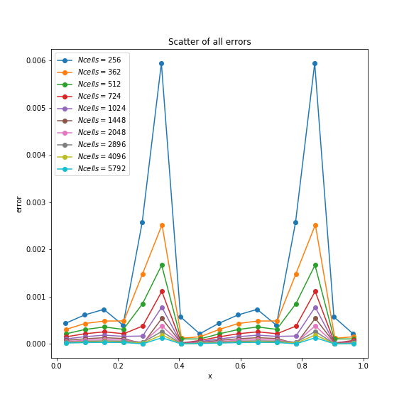

# Hydrodynamics
This is a repo for the homework3 of Computational Physics: solving the Burger equation

## Introduction
In this homework we aim to solve the nonlinear partial differential equation

This is also well-known as the inviscid Burgers equation. 

## Theoretical Analysis
By characteristic method, we can get the characteristic equation

and then we know that 

This implies that along the characteristic curve ,  is constant,

along with the solution to the characteristic equation

offering us an implicit solution to the inviscid Burgers equation

Even though usually due to the complexity of , we will not be able to solve the explicit solution, we can still manipulate  to give a parametric curve as the solution.

However, such a solution cannot guarantee itself to be a function, which is necessary to be the real solution.
After a certain point , this characteristic solution will not hold anymore, along with the formation of shock.

## Numerical Calculation
In this homework we calculated the convergence order of the numerical method offered by William at different resolutions:
- Before the formation of shock, we compare the numerical results with the theoretical implicit solution. The original code of Will is edited by me to be able to offer an exact solution inside the class.
- After the formation of shock, we compare the numerical results with each other to approximate the convergence order, i.e.

where  is the lattice space.

## Findings
Not everywhere (w.r.t. ) our minmod method will reach the order of 2.
This is because only at the shock region, where the numerical method shows obvious errors, the difference of errors among different resolutions can be presented well.

